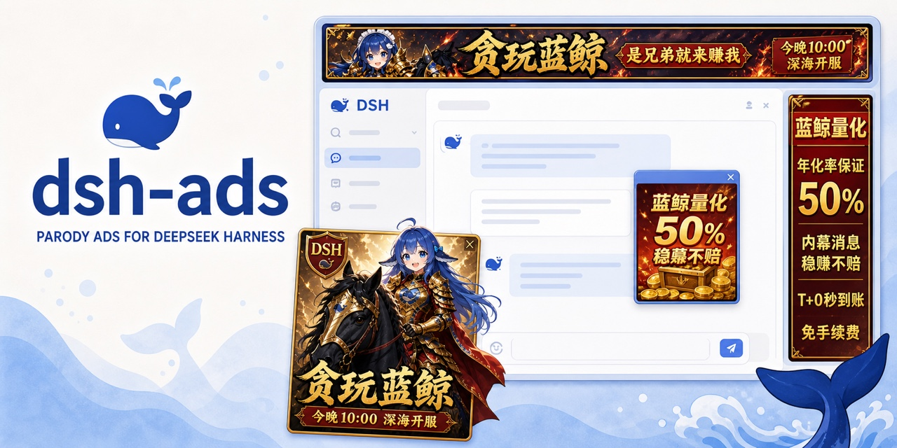
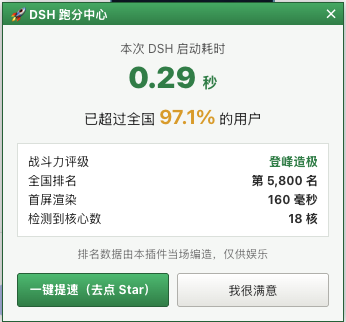

# dsh-ads



<p align="center">
  <a href="README.md">简体中文</a> | <strong>English</strong>
</p>

<p align="center">
  <strong>Turn DeepSeek Harness into a 2005 web portal. Not even inference escapes the ads.</strong><br>
  The ads are fake. The plugins are real. Your odds of unlocking V4 Pro remain terrible.
</p>


`dsh-ads` fills the gutters, conversation, inference, and bottom corner with fictional advertising. A rewarded ad can appear to pause inference while the model keeps working. The rest of the answer and any tool calls become visible when the ad ends.

The sponsored slots promote more than this repository. Public GitHub projects tagged [`dsh-plugin`](https://github.com/topics/dsh-plugin) and updated within the last two weeks enter the rotation. Each ad opens the real repository, and transferring that repository to another account does not remove it from discovery.

## Two kinds of internet trash

Change Settings → Language and the current page immediately swaps the artwork, copy, and interactions without a reload. Chinese mode has browser games, a God of Wealth whale, and endless near-wins. Its two Blue Whale game posters rotate every 20 seconds. English mode has fake antivirus, weird tricks, and actual gameplay*.


<table>
  <tr>
    <th>Chinese: Blue Whale browser game</th>
    <th>English: actual gameplay*</th>
  </tr>
  <tr>
    <td></td>
    <td></td>
  </tr>
</table>

<p align="center">
  <br>
  <sub>The startup time is measured. The nationwide rank is made up.</sub>
</p>

## Install

Install the plugin from GitHub into DSH's `web` profile:

```sh
dsh plugin --profile web add github:Nagi-ovo/dsh-ads
# If dsh web is running, restart it and refresh the page.
```

Run `dsh --profile web --dump-config` to confirm that the plugin is present in the final configuration. For local development, clone the repository and run `dsh plugin --profile web add .` from its root; committed build output means no separate build step is required. Users of the community [plugin-registry](https://github.com/dsh-external/plugin-registry) can also install it from Settings → Plugins.

Every placement has its own switch under Settings → Ads (Unofficial). Choices persist across restarts.


## Free ad inventory

Any public repository tagged `dsh-plugin` can enter the rotation. To provide custom copy or artwork, read the [contribution guide](contrib/README.md) and send a PR. Impression history stays in the local browser.

From the same author, [dsh-visualize](https://github.com/Nagi-ovo/dsh-visualize) lets the model render interactive UI directly inside a conversation. This is the only serious advertisement in this README.

<div align="center">

[](assets/visualize-demo.mp4)

</div>

## Disclaimer

This plugin is entertainment and is not affiliated with DeepSeek or any real company, product, or service. Every brand, person, domain, price, virus, and promise shown in its ads is fictional. The plugin does not scan, read, or modify files on the computer.

“Verify fix” checks GitHub Star status only after the user clicks it. It prefers the local `gh` session or token and otherwise uses the anonymous public API. The result stays in the local browser.
