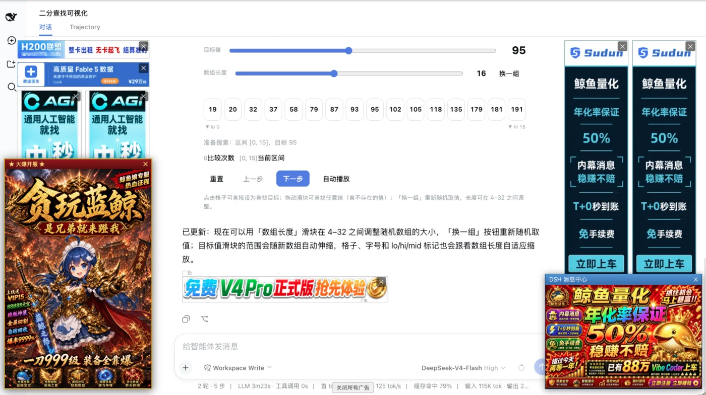
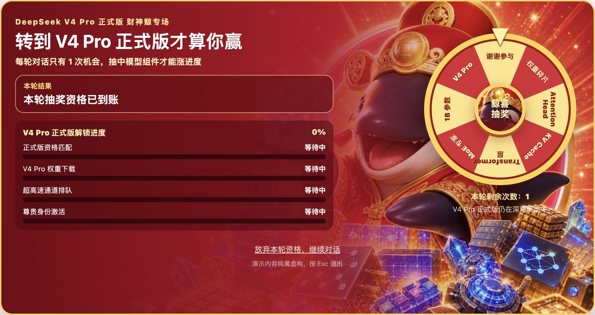
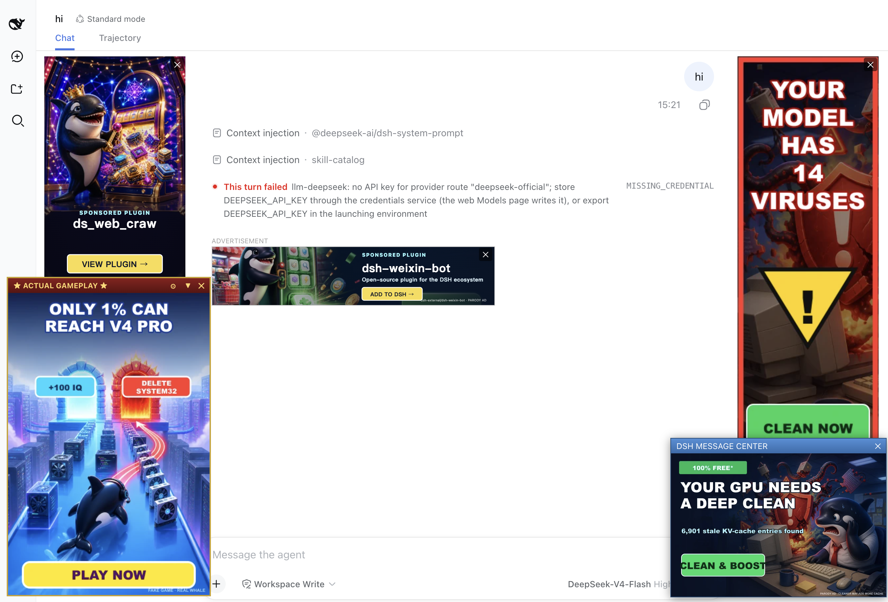
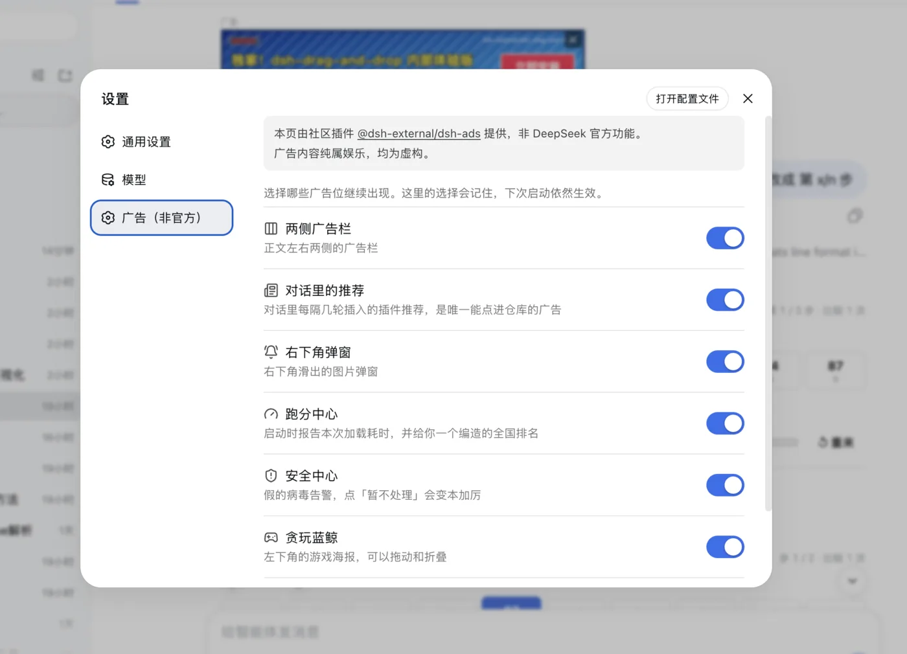

# dsh-ads

<p align="center">
  <strong>简体中文</strong> | <a href="README.en.md">English</a>
</p>

<p align="center">
  <strong>把 DeepSeek Harness 变成 2005 年门户网站。连 inference 都逃不过广告。</strong><br>
  侧栏、对话、推理中途、右下角弹窗，一个都不放过。
</p>



## 能有多离谱

- **能塞广告的地方都塞了。** 两侧广告栏、对话信息流、跑分中心、假杀毒弹窗和假游戏全套供应，同时给输入框和官方弹窗让路。
- **推理到一半也得看广告。** 看起来像暂停，实际上模型没停，后面的回答会等广告结束再一起出现。
- **这次一定能抽到 V4 Pro。** 戴财神帽的虎鲸掌管转盘，奖品包括 Attention Head、KV Cache、MoE 专家，以及永恒的「谢谢参与」。
- **广告是假的，插件是真的。** `dsh-external` 社区插件会随机进入广告位，点击直接打开真实仓库。

## 中文、English，两套互联网垃圾美学

切换 DSH 的「设置 → 语言」，素材、文案和交互会整套更换。不是给中文广告生硬套一层翻译。

### 中文模式：财神鲸抽 V4 Pro



### English mode: fake antivirus, weird tricks, actual gameplay*



<table>
  <tr>
    <th>中文：贪玩蓝鲸（GIF）</th>
    <th>English: actual gameplay*</th>
  </tr>
  <tr>
    <td></td>
    <td></td>
  </tr>
</table>

## 安装

装了社区 [plugin-registry](https://github.com/dsh-external/plugin-registry) 的用户，可以直接在「设置 → 插件」里安装 `dsh-ads`。

也可以链接本地仓库。构建产物已提交，无需额外安装依赖：

```sh
git clone https://github.com/dsh-external/dsh-ads.git
cd /path/to/deepseek-harness
pnpm dsh plugin --profile web add link:/path/to/dsh-ads
# 重启 dsh web，刷新页面
```

所有广告位都能在「设置 → 广告（非官方）」里单独关闭，选择会保留到下次启动。



## 免费广告位，真的

`dsh-external` 里最近两周更新过的插件会自动进入轮播。对话信息流优先展示没出现过的插件，曝光记录只留在本机浏览器里。

想换成自己的文案或图片？看 [投稿说明](contrib/README.md)，发个 PR 就行。

## 顺便打个广告（这次是真的）

同一个作者的 [dsh-visualize](https://github.com/dsh-external/dsh-visualize)：模型直接把可交互界面画进对话流。这条是全 README 唯一没编的。

<div align="center">

https://github.com/user-attachments/assets/93ff08ef-cf32-4a87-bf63-274c1a0a71e2

</div>

<details>
<summary>免责声明</summary>

本插件纯属娱乐，与 DeepSeek 以及任何真实公司、产品或服务均无关联。广告里的品牌、人物、域名、价格、病毒和承诺均为虚构。插件不会扫描、读取或修改机器上的文件。

「验证修复」只会在用户主动点击后查询一次 GitHub Star 状态，优先使用本机 `gh` 或 token，否则调用匿名公开 API。结果只保存在本机浏览器中。

</details>
